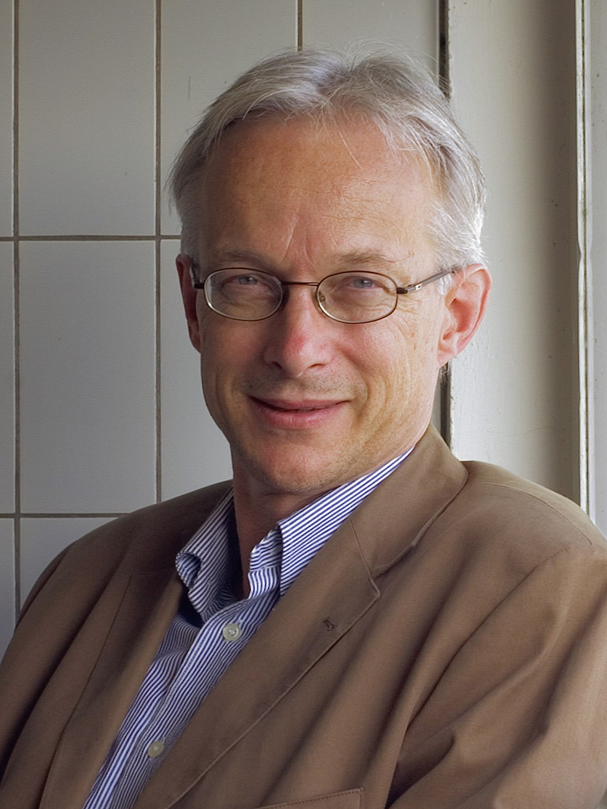
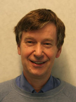



## Adriaan van Wijngaarden
from [Wikipedia](https://en.wikipedia.org/wiki/Adriaan_van_Wijngaarden):
</img>
Adriaan "Aad" van Wijngaarden (2 November 1916 – 7 February 1987) was a Dutch mathematician and computer scientist. Trained as an engineer, Van Wijngaarden would emphasize and promote the mathematical aspects of computing, first in numerical analysis, then in programming languages and finally in design principles of such languages.

Van Wijngaarden was intrigued by the new idea of automatic computing. On 1 January 1947, he became the head of the Computing Department of the brand-new Mathematisch Centrum (MC) in Amsterdam. He then made further visits to England and the United States, gathering ideas for the construction of the first Dutch computer, the ARRA, an electromechanical device first demonstrated in 1952. In that same year, Van Wijngaarden hired Edsger Dijkstra, and they worked on software for the ARRA.
 

## Edsger Dijkstra
from [Wikipedia](https://en.wikipedia.org/wiki/Edsger_W._Dijkstra):
</img>
Edsger Wybe Dijkstra (11 May 1930 – 6 August 2002) was a Dutch computer scientist, programmer, software engineer, systems scientist, science essayist, and pioneer in computing science. A theoretical physicist by training, he worked as a programmer at the Mathematisch Centrum (Amsterdam) from 1952 to 1962. A university professor for much of his life, Dijkstra held the Schlumberger Centennial Chair in Computer Sciences at the University of Texas at Austin from 1984 until his retirement in 1999. He was a professor of mathematics at the Eindhoven University of Technology (1962–1984) and a research fellow at the Burroughs Corporation (1973–1984). In 1972, he became the first person who was neither American nor British to win the Turing Award.

Get more information from the [CWI Dijkstra Fellowships](https://www.cwi.nl/about/history/e-w-dijkstra-brilliant-colourful-and-opinionated)
 

## Jaco de Bakker
from [CWI obituary](https://www.cwi.nl/news/2012/copy2_of_default-page):
</img>
Jacobus Willem (Jaco) de Bakker (Ede, 7 maart 1939 – Amsterdam, 13 december 2012) was for more than 38 years, from 1964 until 2002, connected as Head of the Computer Science Department to the Mathematical Centre, later called CWI  (Centrum Wiskunde & Informatica) in Amsterdam. He was a Fellow of CWI since 2002.
Jaco de Bakker was one of the founding father of theoretical computer science, especially semantics and proof theory.

In 1973 he was appointed as Professor in Computer Science, in particular for the mathematical semantics of programming languages and reasoning on program correctness, at the VU University Amsterdam, at that time called Vrije Universiteit Amsterdam. He occupied this professorship until his emeritate in 2002. In 1989 he was appointed as a member  of the Royal Netherlands Academy of Arts and Sciences (KNAW), in the Section Mathematics. In 1972, Jaco  was one of the founding fathers of the EATCS, the European Association for Theoretical Computer Science; he was Vice-President of the EATCS from 1972 until 1982, and Member of the Board until 1988. Since 1998 he was honorary member of IFIP Working Group 2.2, Formal Description of Programming Concepts. In 2002, during his retirement symposium at CWI, he received the Royal Decoration Knight of the Order of the Lion of the Netherlands (Ridder in de Orde van de Nederlandse Leeuw).

In the Netherlands Jaco de Bakker was the originator of an extensive school of theoretical computer scientists. He supervised many Ph.D.-theses, and was the driving force in the eighties, together with Willem-Paul de Roever and Grzegorz Rozenberg, behind several nation-wide programmes for research and education in the Netherlands, such as REX (Research and Education in Concurrent Systems). REX lasted from 1988 to 1993; it was preceded by LPC (Landelijk Project Concurrency, National Project Concurrency) from 1984-1988. Prior to these programmes Jaco was Director, together with Jan van Leeuwen, of the 'Advanced Course on Foundations of Computer Science', a biennial series of influential courses with international attendance, from 1974 to 1982, held in Amsterdam. Jaco was also one of the founding fathers in 1979 of the Dutch Association for Theoretical Computer Science (WTI, Werkgemeenschap Theoretische Informatica), since 1995 called NVTI (Nederlandse Vereniging voor Theoretische Informatica). Jaco was Chairman of the WTI from 1979 until 1987.Jaco was proud of the fact that 32 scientists who at some time worked in his group were eventually appointed professor.
 

## Jan Karel Lenstra
</img>
from [Wikipedia](https://en.wikipedia.org/wiki/Jan_Karel_Lenstra): Jan Karel Lenstra (born 19 December 1947, in Zaandam) is a Dutch mathematician and operations researcher, known for his work on scheduling algorithms, local search, and the travelling salesman problem.

Lenstra received his Ph.D. from the University of Amsterdam in 1976, advised by Gijsbert de Leve. He then became a researcher at the Centrum Wiskunde & Informatica, where he remained until 1989. After taking positions at the Eindhoven University of Technology (where he became Dean of the Faculty of Mathematics and Computer Science) and the Georgia Institute of Technology, he returned to CWI as its director in 2003. He stepped down in 2011, and at that time became a CWI Fellow.
 

## Hendrik Lenstra
</img>
from [Wikipedia](https://en.wikipedia.org/wiki/Hendrik_Lenstra): Hendrik Willem Lenstra Jr. (born 16 April 1949, Zaandam) is a Dutch mathematician. Lenstra received his doctorate from the University of Amsterdam in 1977 and became a professor there in 1978. In 1987 he was appointed to the faculty of the University of California, Berkeley; starting in 1998, he divided his time between Berkeley and the University of Leiden, until 2003, when he retired from Berkeley to take a full-time position at Leiden.

Lenstra has worked principally in computational number theory. He is well known for:
- Co-discovering of the [Lenstra–Lenstra–Lovász lattice basis reduction algorithm](https://en.wikipedia.org/wiki/Lenstra%E2%80%93Lenstra%E2%80%93Lov%C3%A1sz_lattice_basis_reduction_algorithm) (in 1982);
- Developing an polynomial-time algorithm for solving a feasibility Integer programming problem when the number of variables is fixed (in 1983);
- Discovering the [elliptic curve factorization method](https://en.wikipedia.org/wiki/Lenstra_elliptic-curve_factorization) (in 1987);
- Computing all solutions to the [inverse Fermat equation](https://en.wikipedia.org/wiki/Fermat%27s_Last_Theorem#Inverse_Fermat_equation) (in 1992);
- The [Cohen–Lenstra heuristics](https://en.wikipedia.org/wiki/Class_number_problem#Real_quadratic_fields) - a set of precise conjectures about the structure of class groups of quadratic fields.
 

## Johan van Benthem
</img>
from [Wikipedia](https://en.wikipedia.org/wiki/Johan_van_Benthem_(logician)): Johannes Franciscus Abraham Karel (Johan) van Benthem (born 12 June 1949 in Rijswijk) is a University Professor (universiteitshoogleraar) of logic at the University of Amsterdam at the Institute for Logic, Language and Computation and professor of philosophy at Stanford University (at CSLI). He was awarded the Spinozapremie in 1996[1] and elected a Foreign Fellow of the American Academy of Arts & Sciences in 2015. He is one of the founders of the Institute for Logic, Language and Computation (ILLC).

Van Benthem studied physics (B.Sc. 1969), philosophy (M.A. 1972) and mathematics (M.Sc. 1973) at the University of Amsterdam and received a PhD from the same university under supervision of Martin Löb in 1977. Before becoming University Professor in 2003, he held appointments at the University of Amsterdam (1973–1977), at the University of Groningen (1977–1986), and as a professor at the University of Amsterdam (1986–2003).
In 1992 he was elected member of the Royal Netherlands Academy of Arts and Sciences.

Van Benthem is known for his research in the area of modal logic. This research has resulted in Van Benthem's theorem, which states that propositional modal logic is the fragment of first-order logic that is invariant under bisimulation. He has also been active in the fields of philosophy of science, logical structures in natural language (generalized quantifiers, categorial grammar, substructural proof theory), dynamic logic and update logic, and applications of logic to game theory, as well as applications of game theory to logic (game semantics). Van Benthem is a member of the group collectively publishing under the pseudonym L. T. F. Gamut. He has also taught in China. He made an effort to encourage and organize international collaboration between Chinese and Western logicians.
 

## Jan Bergstra
</img>
from [Wikipedia](https://en.wikipedia.org/wiki/Jan_Bergstra): Johannes Aldert "Jan" Bergstra (born 1951) is a Dutch computer scientist. His work has focussed on logic and the theoretical foundations of software engineering, especially on formal methods for system design. He is best known as an expert on algebraic methods for the specification of data and computational processes in general.

Bergstra held posts at the Institute of Applied Mathematics and Computer Science of the University of Leiden (1976–82), and the Centrum Wiskunde & Informatica (CWI) in Amsterdam. In 1985 he was appointed Professor of Programming and Software Engineering at the Informatics Institute of the University of Amsterdam and, at the same time, Professor of Applied Logic at Utrecht University; such split positions are not uncommon in the Netherlands. These two chairs he continues to hold.
 

## Peter van Emde Boas
[//]: # "comment: text sent to Chris by Peter himself on 7 Oct 2021"
</img>
Peter van Emde Boas (1945) was born and raised in Amsterdam. In 1969 he obtained a master degree in pure mathematics at the University of Amsterdam.
Subsequently his interest shifted to Theoretical Computer Science, resulting in a PhD on the subject of Abstract Complexity Theory in 1974.  His fields of interest include Complexity Theory, Semantics, Database theory, relations with Symbolic Computational Linguistics, Game Theory and Artificial Intelligence. In the field of Data structures he is known as the discoverer of the [van Emde Boas trees](https://en.wikipedia.org/wiki/Van_Emde_Boas_tree).

After having served in part time positions at the Mathematical Centre/CWI in Amsterdam between 1964 and 1977, he became in 1977 full professor in Mathematical Computer Science at the University of Amsterdam in the departments of Mathematics and Computer Science where he had held a part time position  since 1969. In 1985 he had an eight months sabbatical residence as visiting scientist at IBM San Jose Research Center.
There are 22 PhD students who graduated under Peters supervision. During his employment at the University he organized many seminars and served for over 20 years chairing the examination board in Computer Science. He retired from this position in 2009, but remains active in the Institute of Logic Language and Computation which he helped to found around 1990 and in the joint Amsterdam Chinese Logic Center at Tsinghua University. He is notorious for the questions he poses during talks and seminars.  After retiring he is working on the connections between classical Chinese strategy, game theory, and logic.
 

## Theo Janssen
</img>
from [ILLC Obituary](https://www.illc.uva.nl/NewsandEvents/News/Obituaries/Theo-Janssen-1948-2018-/): Theo Janssen started his study in mathematics at the University of Amsterdam in 1966, obtaining a candidate’s degree in 1969 and a master’s degree in 1975. Starting from 1972, he was also a student assistant in the department of mathematics. From 1975 to 1980, he was a junior scientist in the pure mathematics division of the  Mathematical Centre in Amsterdam on a project connecting computation and natural language, and from 1980 to 1985, he held a position in the department of philosophy. Starting from 1985, Theo became an assistant professor in the newly built department of computer science, joining the theory group of Peter van Emde Boas whose main topics were algorithmics and semantics. This group entered the ILLC officially in 1991, where Theo remained active until his retirement in 2013.
 

## David Chaum
from [Wikipedia](https://en.wikipedia.org/wiki/David_Chaum):
</img>
David Chaum (born 1955) is an American computer scientist and cryptographer. He is known as a pioneer in cryptography and privacy-preserving technologies, and widely recognized as the inventor of digital cash. His 1982 dissertation "Computer Systems Established, Maintained, and Trusted by Mutually Suspicious Groups" is the first known proposal for a blockchain protocol. Complete with the code to implement the protocol, Chaum's dissertation proposed all but one element of the blockchain later detailed in the Bitcoin whitepaper.

He is also known for developing ecash, an electronic cash application that aims to preserve a user's anonymity, and inventing many cryptographic protocols like the blind signature, mix networks and the Dining cryptographers protocol. In 1995 his company DigiCash created the first digital currency with eCash. His 1981 paper, "Untraceable Electronic Mail, Return Addresses, and Digital Pseudonyms", laid the groundwork for the field of anonymous communications research.

In the early 80s, Chaum sets up the [CWI Cryptology research group](https://www.cwi.nl/research/groups/cryptology).

More information from the [CWI Dijkstra Fellowship](https://www.cwi.nl/news/blogs/interview-david-chaum-201cblockchain-will-decentralize-power201d).
 

## Paul Vitányi
from [wikipedia](https://en.wikipedia.org/wiki/Paul_Vit%C3%A1nyi):
</img>
Paul Michael Béla Vitányi (born 21 July 1944) is a Dutch computer scientist, Professor of Computer Science at the University of Amsterdam and researcher at the Dutch Centrum Wiskunde & Informatica.

Vitányi was born in Budapest to a Dutch mother and a Hungarian father. He received his degree of mathematical engineer from Delft University of Technology in 1971 and his Ph.D. from the Free University of Amsterdam in 1978. Vitányi was appointed Professor of Computer Science at the University of Amsterdam, and researcher at the National Research Institute for Mathematics and Computer Science in the Netherlands (CWI) where he is currently a CWI Fellow.

Vitányi has worked on cellular automata, computational complexity, distributed and parallel computing, machine learning and prediction, physics of computation, Kolmogorov complexity, information theory and quantum computing, publishing over 200 research papers and some books. As of 2020 his work on normalized compression distance was used in 15 US patents and on normalized Google distance in 10 US patents.

Together with Ming Li he pioneered theory and applications of Kolmogorov complexity. They co-authored the textbook An Introduction to Kolmogorov Complexity and Its Applications, parts of which have been translated into Chinese, Russian and Japanese.
 

## Lex Schrijver
from [wikipedia](https://en.wikipedia.org/wiki/Alexander_Schrijver):
</img>
Alexander (Lex) Schrijver (born 4 May 1948 in Amsterdam) is a Dutch mathematician and computer scientist, a professor of discrete mathematics and optimization at the University of Amsterdam and a fellow at the Centrum Wiskunde & Informatica in Amsterdam.

Schrijver earned his Ph.D. in 1977 from the Vrije Universiteit in Amsterdam, under the supervision of Pieter Cornelis Baayen. He worked for the Centrum Wiskunde & Informatica (under its former name as the Mathematisch Centrum) in pure mathematics from 1973 to 1979, and was a professor at Tilburg University from 1983 to 1989. In 1989 he rejoined the Centrum Wiskunde & Informatica, and in 1990 he also became a professor at the University of Amsterdam. In 2005, he stepped down from management at CWI and instead became a CWI Fellow.

In 2005 Schrijver won the Spinoza Prize of the NWO, the highest scientific award in the Netherlands, for his research in combinatorics and algorithms.
 

## Jan Willem Klop
from [wikipedia](https://en.wikipedia.org/wiki/Jan_Willem_Klop):
</img>
Jan Willem Klop (born 1945) is a professor of applied logic at Vrije Universiteit in Amsterdam. He holds a Ph.D. in mathematical logic from Utrecht University. Klop is known for his work on the Algebra of Communicating Processes, co-author of TeReSe and his fixed point combinator.

Yk = (L L L L L L L L L L L L L L L L L L L L L L L L L L)
where

L = λabcdefghijklmnopqstuvwxyzr. (r (t h i s i s a f i x e d p o i n t c o m b i n a t o r))

Klop became a member of the Royal Netherlands Academy of Arts and Sciences in 2003.
 

## Krzysztof Apt
[//]: # "comment: text sent to Chris by Krzysztof himself on 6 Oct 2021"
</img>
Krzysztof R. Apt is a Fellow at CWI in Amsterdam and Affiliated Professor at the University of
Warsaw. He is also Professor Emeritus at the University of Amsterdam.

He earned his PhD degree in mathematics from the Polish Academy of
Sciences in Warsaw in 1974.  Apt published four books and more than
hundred thirty articles first in mathematical logic, and subsequently in computer science, and,
more recently, theoretical economics.  His research in computer science
has focused on program verification and programming languages, in particular on logic and constraint programming.
In theoretical economics his research has been concerned with game theory
and mechanism design.

During his scientific career he held tenure positions in Poland, France, USA, and the Netherlands.

   

{}
