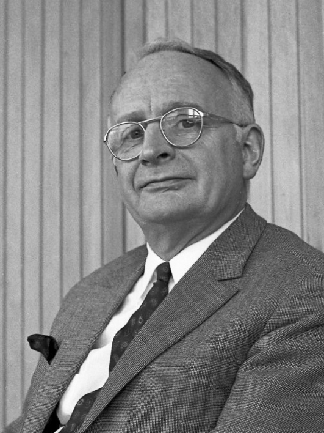
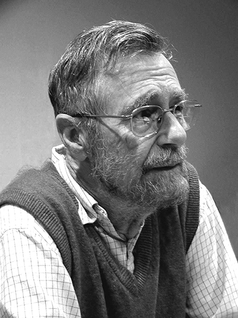
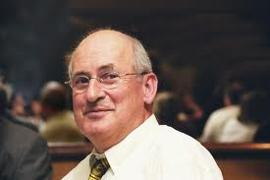
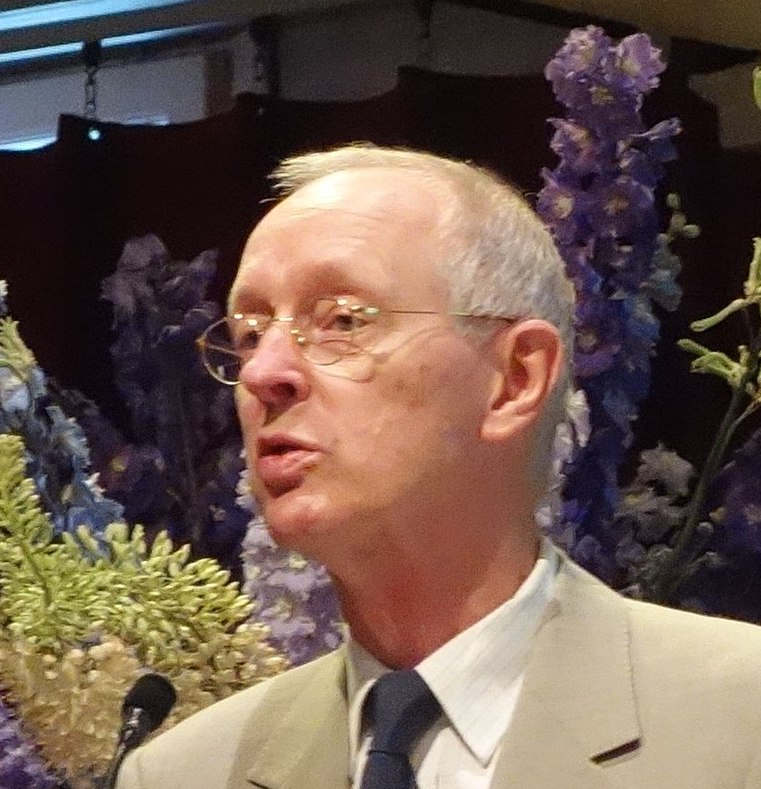
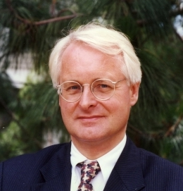
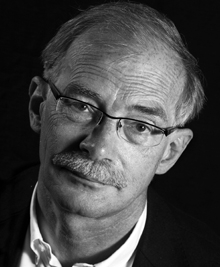
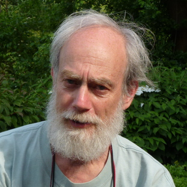
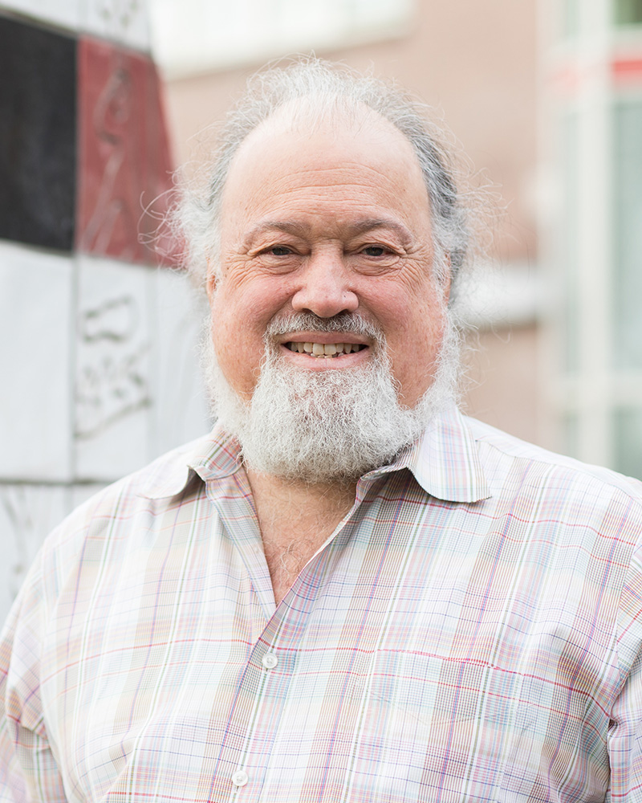
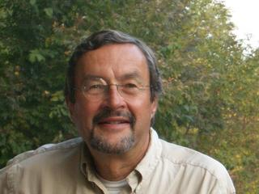
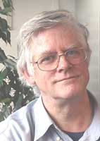



## Adriaan van Wijngaarden
from [Wikipedia](https://en.wikipedia.org/wiki/Adriaan_van_Wijngaarden):
</img>
Adriaan "Aad" van Wijngaarden (2 November 1916 – 7 February 1987) was a Dutch mathematician and computer scientist. Trained as an engineer, Van Wijngaarden would emphasize and promote the mathematical aspects of computing, first in numerical analysis, then in programming languages and finally in design principles of such languages.

Van Wijngaarden was intrigued by the new idea of automatic computing. On 1 January 1947, he became the head of the Computing Department of the brand-new Mathematisch Centrum (MC) in Amsterdam. He then made further visits to England and the United States, gathering ideas for the construction of the first Dutch computer, the ARRA, an electromechanical device first demonstrated in 1952. In that same year, Van Wijngaarden hired Edsger Dijkstra, and they worked on software for the ARRA.
 

## Edsger Dijkstra
from [Wikipedia](https://en.wikipedia.org/wiki/Edsger_W._Dijkstra):
</img>
Edsger Wybe Dijkstra (11 May 1930 – 6 August 2002) was a Dutch computer scientist, programmer, software engineer, systems scientist, science essayist, and pioneer in computing science. A theoretical physicist by training, he worked as a programmer at the Mathematisch Centrum (Amsterdam) from 1952 to 1962. A university professor for much of his life, Dijkstra held the Schlumberger Centennial Chair in Computer Sciences at the University of Texas at Austin from 1984 until his retirement in 1999. He was a professor of mathematics at the Eindhoven University of Technology (1962–1984) and a research fellow at the Burroughs Corporation (1973–1984). In 1972, he became the first person who was neither American nor British to win the Turing Award.

Get more information from the [CWI Dijkstra Fellowships](https://www.cwi.nl/about/history/e-w-dijkstra-brilliant-colourful-and-opinionated)
 

## Jaco de Bakker
from [Wikipedia](https://nl.wikipedia.org/wiki/Jaco_de_Bakker):
</img>
Jacobus Willem (Jaco) de Bakker (Ede, 7 maart 1939 – Amsterdam, 13 december 2012) was een Nederlands theoretisch informaticus en hoogleraar aan de Vrije Universiteit Amsterdam.

De Bakker studeerde wiskunde aan de Vrije Universiteit en de Universiteit van Amsterdam. Bij die laatste promoveerde hij in 1967 onder Aad van Wijngaarden op het proefschrift: Formal Description of Programming Languages: with an application to the definition of ALGOL 60. Al sinds 1964 was hij als wetenschappelijk medewerker werkzaam op het toenmalige Mathematisch Centrum (MC) te Amsterdam (vanaf 1984 het Centrum Wiskunde & Informatica). Hij was vervolgens hoofd van de afdeling informatica, gaf leiding aan het Cluster Software Engineering en was sinds 2002 CWI Fellow. In 1973 werd hij daarnaast hoogleraar informatica aan de Vrije Universiteit, waar hij in 2002 met emeritaat ging.

Als informaticus hield De Bakker zich met name bezig met de mathematische semantiek van programmeertalen (op dit gebied gold hij als een pionier) en de bewijstheorie (correctheid van het programmeren). Hij was in 1972 een van de grondleggers van de European Association for Theoretical Computer Science (EATCS), waarvan hij van 1972 tot 1982 vice-voorzitter was en tot 1988 lid van het bestuur.
 

## Jan Karel Lenstra
</img>
from [Wikipedia](https://en.wikipedia.org/wiki/Jan_Karel_Lenstra): Jan Karel Lenstra (born 19 December 1947, in Zaandam) is a Dutch mathematician and operations researcher, known for his work on scheduling algorithms, local search, and the travelling salesman problem.

Lenstra received his Ph.D. from the University of Amsterdam in 1976, advised by Gijsbert de Leve. He then became a researcher at the Centrum Wiskunde & Informatica, where he remained until 1989. After taking positions at the Eindhoven University of Technology (where he became Dean of the Faculty of Mathematics and Computer Science) and the Georgia Institute of Technology, he returned to CWI as its director in 2003. He stepped down in 2011, and at that time became a CWI Fellow.
 

## Hendrik Lenstra
</img>
Hendrik Willem Lenstra Jr. (born 16 April 1949, Zaandam) is a Dutch mathematician. Lenstra received his doctorate from the University of Amsterdam in 1977 and became a professor there in 1978. In 1987 he was appointed to the faculty of the University of California, Berkeley; starting in 1998, he divided his time between Berkeley and the University of Leiden, until 2003, when he retired from Berkeley to take a full-time position at Leiden.

Lenstra has worked principally in computational number theory. He is well known for:
- Co-discovering of the [Lenstra–Lenstra–Lovász lattice basis reduction algorithm](https://en.wikipedia.org/wiki/Lenstra%E2%80%93Lenstra%E2%80%93Lov%C3%A1sz_lattice_basis_reduction_algorithm) (in 1982);
- Developing an polynomial-time algorithm for solving a feasibility Integer programming problem when the number of variables is fixed (in 1983);
- Discovering the [elliptic curve factorization method](https://en.wikipedia.org/wiki/Lenstra_elliptic-curve_factorization) (in 1987);
- Computing all solutions to the [inverse Fermat equation](https://en.wikipedia.org/wiki/Fermat%27s_Last_Theorem#Inverse_Fermat_equation) (in 1992);
- The [Cohen–Lenstra heuristics](https://en.wikipedia.org/wiki/Class_number_problem#Real_quadratic_fields) - a set of precise conjectures about the structure of class groups of quadratic fields.
 

## Jan Bergstra
</img>
from [Wikipedia](https://en.wikipedia.org/wiki/Jan_Bergstra): Johannes Aldert "Jan" Bergstra (born 1951) is a Dutch computer scientist. His work has focussed on logic and the theoretical foundations of software engineering, especially on formal methods for system design. He is best known as an expert on algebraic methods for the specification of data and computational processes in general.

Bergstra held posts at the Institute of Applied Mathematics and Computer Science of the University of Leiden (1976–82), and the Centrum Wiskunde & Informatica (CWI) in Amsterdam. In 1985 he was appointed Professor of Programming and Software Engineering at the Informatics Institute of the University of Amsterdam and, at the same time, Professor of Applied Logic at Utrecht University; such split positions are not uncommon in the Netherlands. These two chairs he continues to hold.
 

## Peter van Emde Boas
from [Wikipedia](https://en.wikipedia.org/wiki/Peter_van_Emde_Boas):
</img>
Peter van Emde Boas (born 3 April 1945, Amsterdam) is a Dutch computer scientist and professor at the University of Amsterdam. He gained his doctorate in 1974 under Adriaan van Wijngaarden. The [Van Emde Boas tree](https://en.wikipedia.org/wiki/Van_Emde_Boas_tree) is named after him.
 

## David Chaum
from [Wikipedia](https://en.wikipedia.org/wiki/David_Chaum):
</img>
David Chaum (born 1955) is an American computer scientist and cryptographer. He is known as a pioneer in cryptography and privacy-preserving technologies, and widely recognized as the inventor of digital cash. His 1982 dissertation "Computer Systems Established, Maintained, and Trusted by Mutually Suspicious Groups" is the first known proposal for a blockchain protocol. Complete with the code to implement the protocol, Chaum's dissertation proposed all but one element of the blockchain later detailed in the Bitcoin whitepaper.

He is also known for developing ecash, an electronic cash application that aims to preserve a user's anonymity, and inventing many cryptographic protocols like the blind signature, mix networks and the Dining cryptographers protocol. In 1995 his company DigiCash created the first digital currency with eCash. His 1981 paper, "Untraceable Electronic Mail, Return Addresses, and Digital Pseudonyms", laid the groundwork for the field of anonymous communications research.

In the early 80s, Chaum sets up the [CWI Cryptology research group](https://www.cwi.nl/research/groups/cryptology).

More information from the [CWI Dijkstra Fellowship](https://www.cwi.nl/news/blogs/interview-david-chaum-201cblockchain-will-decentralize-power201d).
 

## Paul Vitányi
from [wikipedia](https://en.wikipedia.org/wiki/Paul_Vit%C3%A1nyi):
</img>
Paul Michael Béla Vitányi (born 21 July 1944) is a Dutch computer scientist, Professor of Computer Science at the University of Amsterdam and researcher at the Dutch Centrum Wiskunde & Informatica.

Vitányi was born in Budapest to a Dutch mother and a Hungarian father. He received his degree of mathematical engineer from Delft University of Technology in 1971 and his Ph.D. from the Free University of Amsterdam in 1978. Vitányi was appointed Professor of Computer Science at the University of Amsterdam, and researcher at the National Research Institute for Mathematics and Computer Science in the Netherlands (CWI) where he is currently a CWI Fellow.

Vitányi has worked on cellular automata, computational complexity, distributed and parallel computing, machine learning and prediction, physics of computation, Kolmogorov complexity, information theory and quantum computing, publishing over 200 research papers and some books. As of 2020 his work on normalized compression distance was used in 15 US patents and on normalized Google distance in 10 US patents.

Together with Ming Li he pioneered theory and applications of Kolmogorov complexity. They co-authored the textbook An Introduction to Kolmogorov Complexity and Its Applications, parts of which have been translated into Chinese, Russian and Japanese.
 

## Lex Schrijver
from [wikipedia](https://en.wikipedia.org/wiki/Alexander_Schrijver):
</img>
Alexander (Lex) Schrijver (born 4 May 1948 in Amsterdam) is a Dutch mathematician and computer scientist, a professor of discrete mathematics and optimization at the University of Amsterdam and a fellow at the Centrum Wiskunde & Informatica in Amsterdam.

Schrijver earned his Ph.D. in 1977 from the Vrije Universiteit in Amsterdam, under the supervision of Pieter Cornelis Baayen. He worked for the Centrum Wiskunde & Informatica (under its former name as the Mathematisch Centrum) in pure mathematics from 1973 to 1979, and was a professor at Tilburg University from 1983 to 1989. In 1989 he rejoined the Centrum Wiskunde & Informatica, and in 1990 he also became a professor at the University of Amsterdam. In 2005, he stepped down from management at CWI and instead became a CWI Fellow.

In 2005 Schrijver won the Spinoza Prize of the NWO, the highest scientific award in the Netherlands, for his research in combinatorics and algorithms.
 

## Jan Willem Klop
from [wikipedia](https://en.wikipedia.org/wiki/Jan_Willem_Klop):
</img>
Jan Willem Klop (born 1945) is a professor of applied logic at Vrije Universiteit in Amsterdam. He holds a Ph.D. in mathematical logic from Utrecht University. Klop is known for his work on the Algebra of Communicating Processes, co-author of TeReSe and his fixed point combinator.

Yk = (L L L L L L L L L L L L L L L L L L L L L L L L L L)
where

L = λabcdefghijklmnopqstuvwxyzr. (r (t h i s i s a f i x e d p o i n t c o m b i n a t o r))

Klop became a member of the Royal Netherlands Academy of Arts and Sciences in 2003.
 

## Krysztof Apt
From the 2010 biographical note [Krzysztof Apt](https://homepages.cwi.nl/~apt/)'s homepage:
</img>
Currently, the main interest of Apt is game theory and mechanism design. These are two areas of theoretical economics but in the advent of internet economics they are nowadays also of relevance for computer science. "It is fascinating to see how quickly the borders between computer science and economics melt. Some articles can now be submitted either to a conference on Artificial Intelligence or electronic commerce, or to an economic journal. And some, like our recent work on distributed mechanism design, draw on ideas from both disciplines."

Apt is still interested in two areas of research in computer science in which he has been involved in the past twenty five years, namely program verification and constraint programming.
   

{}
