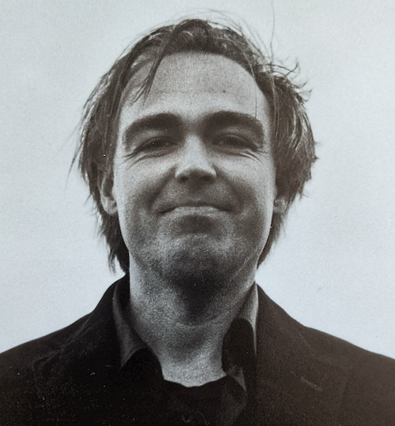
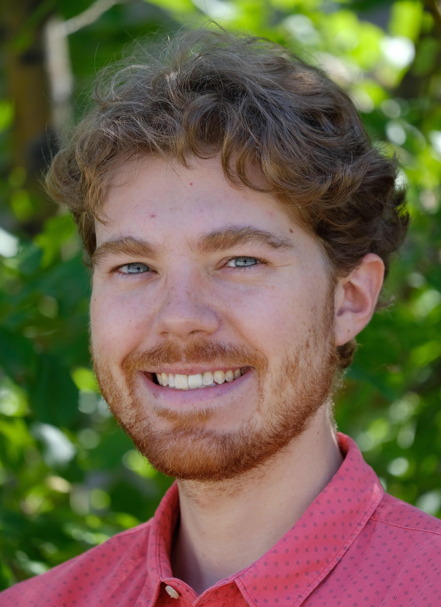

We are happy to announce the hiring of three new faculty members in Theoretical Computer Science (TCS) at the University of Amsterdam, thereby further growing the active community of TCS researchers in Amsterdam.

Rebecca Reiffenhäuser and Balder ten Cate are joining the Institute for Logic, Language and Computation (ILLC), and Nicolas Resch is joining the Theory of Computer Science group at the Informatics Institute, all at the Faculty of Science (FNWI) of the UvA.
<!--more-->

</img>
**Balder ten Cate** (PhD Amsterdam, 2005), currently a fixed-term senior researcher at the ILLC and previously a software engineer at Google, will join the ILLC as Associate Professor this summer. Balder's research spans a number of applications of logic in computer science and AI, with a particular focus on data management and knowledge representation, as well as computational learning theory.
 

</img>
**Rebecca Reiffenhäuser** (PhD Aachen, 2018), currently a postdoc at Sapienza University in Rome, will join the ILLC as Assistant Professor in December. The focus of Rebecca's research is on the design and analysis of algorithms in the presence of uncertainty, when full information about the problem at hand is unavailable or cannot be processed. Her work has strong links to algorithmic game theory and machine learning.
 

</img>
**Nicolas Resch** (PhD Carnegie Mellon University, 2020), currently postdoc at CWI Amsterdam, will join the TCS group at the Informatics Institute in September 2022. Nic is an expert in coding and information theory, and he is working in the intersection of coding theory and cryptography, with the goal of designing efficient quantum-secure cryptographic protocols.
